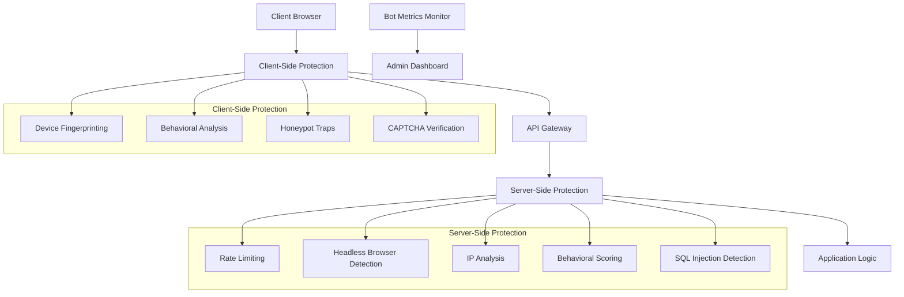
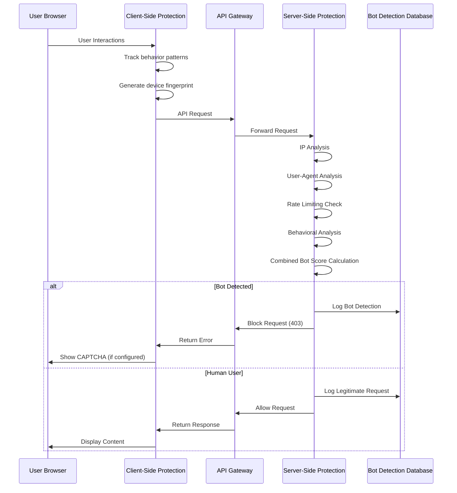
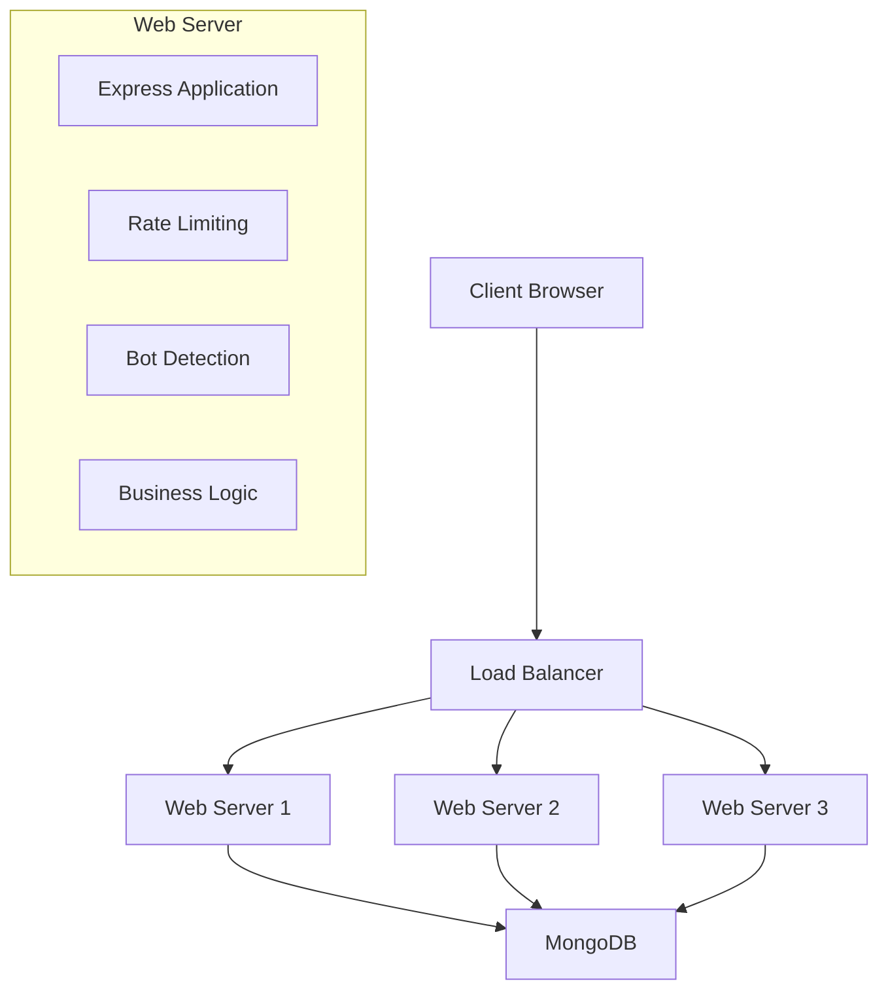

# NextBuy Bot Protection System: Technical Documentation

## System Architecture Overview

The NextBuy bot protection system implements a multi-layered defense architecture that combines client-side and server-side protection mechanisms to provide comprehensive security against automated threats.



## Technical Implementation Details

### 1. Client-Side Protection

#### Device Fingerprinting

Implemented using FingerprintJS to create a unique identifier for each device:

```javascript
// Initialize fingerprint library
const fpPromise = FingerprintJS.load();

// Get device fingerprint
export const getDeviceFingerprint = async () => {
  try {
    const fp = await fpPromise;
    const result = await fp.get();
    return result.visitorId;
  } catch (error) {
    console.error('Error getting fingerprint:', error);
    return null;
  }
};
```

#### Behavioral Analysis

Tracks user interactions to identify bot-like behavior:

- Mouse movement tracking
- Click speed analysis 
- Form fill time measurement
- Navigation pattern analysis

```javascript
// Track user behavior
export const trackUserBehavior = () => {
  // Track mouse movements
  document.addEventListener('mousemove', (event) => {
    // Only store every 10th movement to avoid excessive data
    if (mouseMovements.length % 10 === 0) {
      mouseMovements.push({
        x: event.clientX,
        y: event.clientY,
        timestamp: Date.now()
      });
    }
  });
  
  // Track clicks and form interactions
  // ...
};
```

#### Honeypot Traps

Hidden form fields that only bots would fill out:

```javascript
export const addHoneypotToForm = (formElement) => {
  if (!formElement) return;
  
  // Create honeypot fields (invisible to humans)
  const honeypotField = document.createElement('input');
  honeypotField.type = 'text';
  honeypotField.name = 'website'; // Bots often fill fields named "website"
  
  // Style to hide from humans but keep accessible to bots
  honeypotField.style.opacity = '0';
  honeypotField.style.position = 'absolute';
  honeypotField.style.height = '0';
  // ...
};
```

#### CAPTCHA Integration

Google reCAPTCHA v2 integration with server-side validation:

```javascript
const handleCaptchaChange = async (token) => {
  if (!token) {
    setError('CAPTCHA verification failed. Please try again.');
    if (onFailure) onFailure();
    return;
  }
  
  try {
    // Get device fingerprint
    const deviceFingerprint = await getDeviceFingerprint();
    
    // Send verification to server
    const response = await axios.post('/api/bot-protection/captcha-verification', {
      captchaToken: token,
      deviceFingerprint
    });
    // ...
  }
};
```

### 2. Server-Side Protection

#### Rate Limiting

Configured rate limits for different types of requests:

```javascript
// Rate limiting middleware with path-based exclusions
export const apiRateLimit = rateLimit({
  windowMs: 2 * 60 * 1000, // 2 minutes
  max: 5, // limit each IP to 5 requests per windowMs
  standardHeaders: true,
  legacyHeaders: false,
  message: { error: 'Too many requests, please try again later.' },
  keyGenerator: (req) => {
    // Use IP address and user agent as the key for more granular rate limiting
    return `${req.ip}-${req.headers['user-agent'] || 'unknown'}`;
  },
  // ...
});
```

#### Headless Browser Detection

Detects automation tools like Puppeteer, Selenium, etc.:

```javascript
export const detectHeadlessBrowser = (req, res, next) => {
  const userAgent = req.headers['user-agent'] || '';
  const parser = new UAParser(userAgent);
  const browser = parser.getBrowser();
  const os = parser.getOS();
  
  // Enhanced headless browser indicators
  const headlessIndicators = [
    'headless', 'phantomjs', 'puppeteer', 'selenium', 'webdriver',
    'chrome-headless', 'playwright', 'jsdom', 'nightmare', 'zombie'
  ];
  
  // Check for inconsistencies that may indicate a spoofed user agent
  const hasInconsistencies = (
    (browser.name === 'Chrome' && !userAgent.includes('Chrome')) ||
    (browser.name === 'Firefox' && !userAgent.includes('Firefox')) ||
    // ...
  );
  
  // ...
};
```

#### IP Address Analysis

Analyzes IP addresses for suspicious patterns:

```javascript
export const analyzeIP = async (req, res, next) => {
  const clientIP = req.ip || req.connection.remoteAddress;
  
  try {
    // Fetch geolocation data from ip-api.com
    const geoResponse = await fetch(`http://ip-api.com/json/${clientIP}?fields=status,message,country,countryCode,region,regionName,city,zip,lat,lon,timezone,isp,org,as,proxy,hosting,query`);
    const geoData = await geoResponse.json();
    
    if (geoData.status === 'success') {
      // Calculate risk score based on geolocation data
      let riskScore = 0.3; // Base score for external IPs
      
      // High-risk countries (common sources of bot traffic)
      const highRiskCountries = ['CN', 'RU', 'KP', 'IR', 'VN', 'BD', 'PK', 'ID'];
      if (highRiskCountries.includes(geoData.countryCode)) {
        riskScore += 0.3;
      }
      
      // Check for VPN/Proxy indicators
      // ...
    }
  } catch (error) {
    // ...
  }
};
```

#### SQL Injection Detection

Identifies common SQL injection patterns:

```javascript
export const sqlInjectionCheck = (req, res, next) => {
  // Common SQL injection patterns
  const sqlPatterns = [
    /('|(\-\-)|(;)|(\||\|)|(\*|\*))/i,
    /(union|select|insert|update|delete|drop|create|alter|exec|execute)/i,
    // ...
  ];
  
  // Function to check a value for SQL injection
  const checkForSQLInjection = (value) => {
    if (typeof value !== 'string') return false;
    return sqlPatterns.some(pattern => pattern.test(value));
  };
  
  // Check request body, query parameters, and URL parameters
  // ...
};
```

### 3. Combined Bot Detection

The system combines multiple detection methods for comprehensive protection:

```javascript
export const botDetection = (req, res, next) => {
  // Combine all scores to determine if the request is from a bot
  const combinedScore = (
    (req.botScore || 0.5) * 0.3 +
    (req.ipScore || 0.5) * 0.2 +
    (req.behaviorScore || 0.5) * 0.5
  );
  
  req.isSuspectedBot = combinedScore > 0.5; // Lower threshold for stricter detection
  
  // Handle different types of bots
  if (req.isSuspectedBot) {
    // Log detection and block request
    // ...
  }
  
  next();
};
```

## Data Flow & Processing



## Metrics Collection & Analysis

The system collects comprehensive metrics on bot traffic:

```javascript
export function logBotDetection(data) {
  metrics.totalRequests++;
  metrics.detectedBots++;
  
  // Increment detection method counter
  if (data.method && metrics.detectionMethods[data.method] !== undefined) {
    metrics.detectionMethods[data.method]++;
  }
  
  // Track IP addresses, user agents, request paths, etc.
  // ...
  
  // Add detailed log entry
  metrics.detailedLogs.push({
    timestamp: new Date().toISOString(),
    method: data.method,
    ip: data.ip,
    userAgent: data.userAgent,
    path: data.path,
    details: data.details,
    severity: determineSeverity(data)
  });
  
  // ...
}
```

## Testing & Verification

The system includes comprehensive tests to verify protection effectiveness:

```python
def test_headless_browser_detection():
    """Test headless browser detection"""
    print("\n🤖 Testing Headless Browser Detection...")
    
    headless_agents = [
        "Mozilla/5.0 (X11; Linux x86_64) AppleWebKit/537.36 (KHTML, like Gecko) HeadlessChrome/91.0.4472.0 Safari/537.36",
        "Mozilla/5.0 (Unknown; Linux x86_64) AppleWebKit/534.34 (KHTML, like Gecko) PhantomJS/1.9.8 Safari/534.34"
    ]
    
    # Test each headless browser user agent
    # ...
```

## Integration Points

### 1. Component Integration

Client-side components are integrated into the React application:

```jsx
// Protecting routes from bots
<BotProtectedRoute>
  <YourComponent />
</BotProtectedRoute>

// Adding honeypot to forms
<HoneypotForm onSubmit={handleSubmit}>
  {/* Your form fields */}
</HoneypotForm>
```

### 2. API Integration

Server-side middleware is integrated into Express routes:

```javascript
// Apply rate limiting to all routes
app.use(apiRateLimit);

// Apply bot detection to specific routes
app.use('/api', botDetection);
app.use('/api/auth', authRateLimit);

// Apply SQL injection detection
app.use(sqlInjectionCheck);
```

## Performance Considerations

1. **Client Impact**: Behavioral tracking is optimized to minimize performance impact:
   - Only stores every 10th mouse movement
   - Limits collection sizes
   - Uses throttling techniques

2. **Server Efficiency**: 
   - IP geolocation data is cached
   - Request filtering happens early in the middleware chain
   - Resource-intensive checks are only performed when necessary

## Security Measures

1. **Defense in Depth**: Multiple independent detection mechanisms
2. **Fail-Secure Design**: System defaults to security when detection methods fail
3. **Silent Failures**: Bots are not informed of detection methods
4. **Regular Updates**: Detection patterns are regularly updated

## Deployment Architecture



## Configuration Options

Key configuration parameters:

```javascript
// Rate limiting configuration
export const apiRateLimit = rateLimit({
  windowMs: 15 * 60 * 1000, // 15 minutes
  max: 100, // limit each IP to 100 requests per windowMs
  // ...
});

// CAPTCHA configuration
<ReCAPTCHA
  sitekey="YOUR_SITE_KEY_HERE"
  onChange={handleCaptchaChange}
/>
```

## Future Technical Roadmap

1. **Machine Learning Integration**:
   - Train models on historical bot patterns
   - Implement anomaly detection algorithms
   - Dynamic threshold adjustments

2. **Enhanced Browser Fingerprinting**:
   - Canvas fingerprinting
   - Audio fingerprinting
   - WebGL fingerprinting

3. **Advanced Behavioral Biometrics**:
   - Keystroke dynamics analysis
   - Mouse movement entropy measurement
   - Scroll pattern analysis

4. **Real-time Threat Intelligence**:
   - Integration with threat intelligence feeds
   - Automated blocklist updates
   - Cross-account attack correlation

5. **Metrics and Monitoring Enhancements**:
   - Real-time dashboard
   - Predictive analytics
   - Alert thresholds and notifications